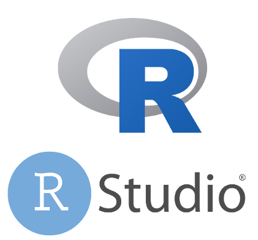
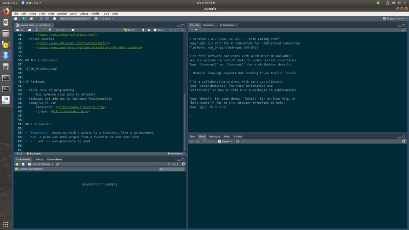

```{r setup, include=FALSE}
knitr::opts_chunk$set(echo = FALSE)
```


## What is R and why use it?

- Statistical programming language
- Used around the world
- Open source
    - Free as in beer
    - Free as in speach


## Help!

- Excellent support (e.g.)
    - <https://stackoverflow.com/questions/tagged/r>
    - <https://community.rstudio.com/>
    - <https://www.jumpingrivers.com/>
    - <https://www.mango-solutions.com/>
- Online courses
    - <https://www.datacamp.com/courses/tech:r>
    - <https://www.coursera.org/specializations/jhu-data-science>


## The R interface




## The R interface




## Packages

- First rule of programming
    - has someone else done it already?
- Packages are add ons to increase functionality
- Today we'll use
    - tidyverse: <https://www.tidyverse.org/>
    - igraph: <http://igraph.org/r/>


## R signposts

- `function()` Anything with brackets is a function, like a spreadsheet
- `%>%` A pipe can send output from a function to the next line
- `<-` and `=` can generally be used 
- `?function` brings up help menu
- `# this is a comment`


## Helpful lingo

- "Data frame" is a table with rows and columns
- "Vector" is a set of values that are all the same type:
    - Numeric
    - Character
    - ...


## Tidyverse packages

- `readr` for reading plain text files
- `dplyr` for database type operations
- `tidyr` for wide to long transformations
- `ggplot2` for visualisation
