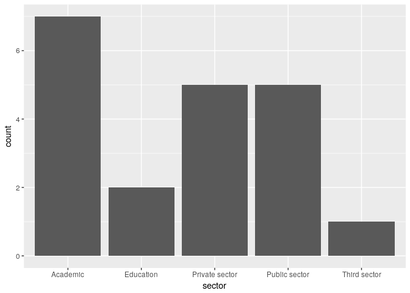
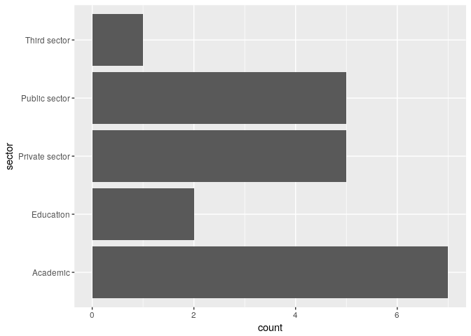
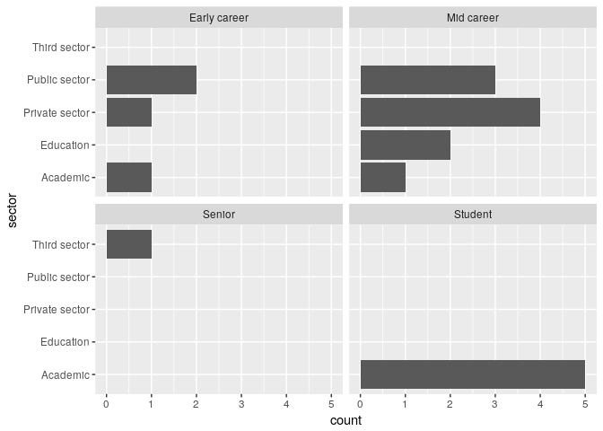

Data to a network visualisation
================
Mike Spencer
14 March 2018

Packages
--------

-   Install only once
-   Load into session with `library()`

``` r
# install.packages("tidyverse")
# install.packages("igraph")

library(tidyverse)
```

    ## ── Attaching packages ────────────────────────────────────────────────────────────────────────── tidyverse 1.2.1 ──

    ## ✔ ggplot2 2.2.1     ✔ purrr   0.2.4
    ## ✔ tibble  1.3.4     ✔ dplyr   0.7.4
    ## ✔ tidyr   0.7.2     ✔ stringr 1.2.0
    ## ✔ readr   1.1.1     ✔ forcats 0.2.0

    ## ── Conflicts ───────────────────────────────────────────────────────────────────────────── tidyverse_conflicts() ──
    ## ✖ dplyr::filter() masks stats::filter()
    ## ✖ dplyr::lag()    masks stats::lag()

``` r
#library(igraph)
```

Reading data
------------

``` r
# Reads and outputs to console
read_csv("../data/SNA_anon_delegates.csv")
```

    ## Parsed with column specification:
    ## cols(
    ##   timestamp = col_character(),
    ##   name = col_character(),
    ##   affiliation = col_character(),
    ##   seniority = col_character(),
    ##   expertise = col_character(),
    ##   want_to_learn = col_character()
    ## )

    ## # A tibble: 27 x 6
    ##              timestamp      name     affiliation    seniority
    ##                  <chr>     <chr>           <chr>        <chr>
    ##  1 02/03/2018 21:10:15  Person 1  Research - CSS   Mid career
    ##  2 02/03/2018 21:44:54  Person 2  Research - AVS Early career
    ##  3 02/03/2018 21:47:45  Person 3 Research - LEES Early career
    ##  4 02/03/2018 23:03:18  Person 4  Research - FFS      Student
    ##  5 03/03/2018 04:53:02  Person 5  Research - FFS Early career
    ##  6 03/03/2018 10:26:59  Person 6  Research - AVS      Student
    ##  7 03/03/2018 10:32:22  Person 7  Research - FFS Early career
    ##  8 03/03/2018 11:56:24  Person 8  Research - AVS      Student
    ##  9 03/03/2018 13:30:19  Person 9  Research - CSS Early career
    ## 10 03/03/2018 14:39:47 Person 10 Research - LEES   Mid career
    ## # ... with 17 more rows, and 2 more variables: expertise <chr>,
    ## #   want_to_learn <chr>

``` r
# Reads and assigns to object df
df = read_csv("../data/SNA_anon_delegates.csv")
```

    ## Parsed with column specification:
    ## cols(
    ##   timestamp = col_character(),
    ##   name = col_character(),
    ##   affiliation = col_character(),
    ##   seniority = col_character(),
    ##   expertise = col_character(),
    ##   want_to_learn = col_character()
    ## )

Selecting columns
-----------------

``` r
# Data followed by columns we want
select(df, name, affiliation, seniority, expertise)
```

    ## # A tibble: 27 x 4
    ##         name     affiliation    seniority             expertise
    ##        <chr>           <chr>        <chr>                 <chr>
    ##  1  Person 1  Research - CSS   Mid career Genstat, Visual basic
    ##  2  Person 2  Research - AVS Early career                MaxQDA
    ##  3  Person 3 Research - LEES Early career               FORTRAN
    ##  4  Person 4  Research - FFS      Student                     R
    ##  5  Person 5  Research - FFS Early career                   SQL
    ##  6  Person 6  Research - AVS      Student                     R
    ##  7  Person 7  Research - FFS Early career                     R
    ##  8  Person 8  Research - AVS      Student  MS/Libre/Open office
    ##  9  Person 9  Research - CSS Early career                     R
    ## 10 Person 10 Research - LEES   Mid career                 Stata
    ## # ... with 17 more rows

``` r
# Or data followed by columns we don't want
select(df, -timestamp, -want_to_learn)
```

    ## # A tibble: 27 x 4
    ##         name     affiliation    seniority             expertise
    ##        <chr>           <chr>        <chr>                 <chr>
    ##  1  Person 1  Research - CSS   Mid career Genstat, Visual basic
    ##  2  Person 2  Research - AVS Early career                MaxQDA
    ##  3  Person 3 Research - LEES Early career               FORTRAN
    ##  4  Person 4  Research - FFS      Student                     R
    ##  5  Person 5  Research - FFS Early career                   SQL
    ##  6  Person 6  Research - AVS      Student                     R
    ##  7  Person 7  Research - FFS Early career                     R
    ##  8  Person 8  Research - AVS      Student  MS/Libre/Open office
    ##  9  Person 9  Research - CSS Early career                     R
    ## 10 Person 10 Research - LEES   Mid career                 Stata
    ## # ... with 17 more rows

Filter by row value
-------------------

``` r
# Single filter
filter(df, affiliation=="Research - LEES")
```

    ## # A tibble: 9 x 6
    ##             timestamp      name     affiliation    seniority
    ##                 <chr>     <chr>           <chr>        <chr>
    ## 1 02/03/2018 21:47:45  Person 3 Research - LEES Early career
    ## 2 03/03/2018 14:39:47 Person 10 Research - LEES   Mid career
    ## 3 04/03/2018 13:03:34 Person 12 Research - LEES      Student
    ## 4 04/03/2018 21:56:33 Person 14 Research - LEES   Mid career
    ## 5 05/03/2018 09:25:32 Person 15 Research - LEES      Student
    ## 6 05/03/2018 09:55:59 Person 16 Research - LEES Early career
    ## 7 05/03/2018 17:10:43 Person 21 Research - LEES      Student
    ## 8 06/03/2018 17:10:11 Person 24 Research - LEES   Mid career
    ## 9 08/03/2018 01:25:19 Person 26 Research - LEES      Student
    ## # ... with 2 more variables: expertise <chr>, want_to_learn <chr>

``` r
# Exclude
filter(df, expertise!="R")
```

    ## # A tibble: 16 x 6
    ##              timestamp      name                affiliation    seniority
    ##                  <chr>     <chr>                      <chr>        <chr>
    ##  1 02/03/2018 21:10:15  Person 1             Research - CSS   Mid career
    ##  2 02/03/2018 21:44:54  Person 2             Research - AVS Early career
    ##  3 02/03/2018 21:47:45  Person 3            Research - LEES Early career
    ##  4 03/03/2018 04:53:02  Person 5             Research - FFS Early career
    ##  5 03/03/2018 11:56:24  Person 8             Research - AVS      Student
    ##  6 03/03/2018 14:39:47 Person 10            Research - LEES   Mid career
    ##  7 04/03/2018 08:48:31 Person 11             Research - FFS       Senior
    ##  8 04/03/2018 21:56:33 Person 14            Research - LEES   Mid career
    ##  9 05/03/2018 09:25:32 Person 15            Research - LEES      Student
    ## 10 05/03/2018 11:46:48 Person 20 Corporate/support services   Mid career
    ## 11 05/03/2018 17:10:43 Person 21            Research - LEES      Student
    ## 12 05/03/2018 17:42:18 Person 22                 Consulting       Senior
    ## 13 06/03/2018 09:09:50 Person 23                 Consulting       Senior
    ## 14 07/03/2018 16:44:49 Person 25                 Consulting   Mid career
    ## 15 08/03/2018 01:25:19 Person 26            Research - LEES      Student
    ## 16 08/03/2018 13:15:20 Person 27                  Education   Mid career
    ## # ... with 2 more variables: expertise <chr>, want_to_learn <chr>

``` r
# Multiple & or |
filter(df, affiliation=="Research - LEES" & expertise=="R")
```

    ## # A tibble: 3 x 6
    ##             timestamp      name     affiliation    seniority expertise
    ##                 <chr>     <chr>           <chr>        <chr>     <chr>
    ## 1 04/03/2018 13:03:34 Person 12 Research - LEES      Student         R
    ## 2 05/03/2018 09:55:59 Person 16 Research - LEES Early career         R
    ## 3 06/03/2018 17:10:11 Person 24 Research - LEES   Mid career         R
    ## # ... with 1 more variables: want_to_learn <chr>

``` r
# With a pipe
df %>% 
   select(-timestamp, -want_to_learn) %>% 
   filter(affiliation=="Research - LEES" & expertise=="R")
```

    ## # A tibble: 3 x 4
    ##        name     affiliation    seniority expertise
    ##       <chr>           <chr>        <chr>     <chr>
    ## 1 Person 12 Research - LEES      Student         R
    ## 2 Person 16 Research - LEES Early career         R
    ## 3 Person 24 Research - LEES   Mid career         R

``` r
# With numbers
# filter(df, col_num==10)
# filter(df, col_num>10)
# etc.
```

Summaries
---------

``` r
# Basic how many?
count(df, expertise)
```

    ## # A tibble: 12 x 2
    ##                                       expertise     n
    ##                                           <chr> <int>
    ##  1                                       ArcGIS     1
    ##  2                                          CBS     2
    ##  3                             Excel (advanced)     1
    ##  4                                      FORTRAN     1
    ##  5                        Genstat, Visual basic     1
    ##  6                                       MaxQDA     1
    ##  7                         MS/Libre/Open office     5
    ##  8 Network analysis sofware like biolayout/Miru     1
    ##  9                                         None     1
    ## 10                                            R    11
    ## 11                                          SQL     1
    ## 12                                        Stata     1

``` r
# Ordered
df %>% 
   count(expertise) %>% 
   arrange(n)
```

    ## # A tibble: 12 x 2
    ##                                       expertise     n
    ##                                           <chr> <int>
    ##  1                                       ArcGIS     1
    ##  2                             Excel (advanced)     1
    ##  3                                      FORTRAN     1
    ##  4                        Genstat, Visual basic     1
    ##  5                                       MaxQDA     1
    ##  6 Network analysis sofware like biolayout/Miru     1
    ##  7                                         None     1
    ##  8                                          SQL     1
    ##  9                                        Stata     1
    ## 10                                          CBS     2
    ## 11                         MS/Libre/Open office     5
    ## 12                                            R    11

``` r
# For more complex things
df %>% 
   group_by(seniority, expertise) %>% 
   summarise(n=n()) %>% 
   arrange(n)
```

    ## # A tibble: 17 x 3
    ## # Groups:   seniority [4]
    ##       seniority                                    expertise     n
    ##           <chr>                                        <chr> <int>
    ##  1 Early career                                      FORTRAN     1
    ##  2 Early career                                       MaxQDA     1
    ##  3 Early career                                          SQL     1
    ##  4   Mid career                                       ArcGIS     1
    ##  5   Mid career                                          CBS     1
    ##  6   Mid career                             Excel (advanced)     1
    ##  7   Mid career                        Genstat, Visual basic     1
    ##  8   Mid career                         MS/Libre/Open office     1
    ##  9   Mid career                                            R     1
    ## 10   Mid career                                        Stata     1
    ## 11       Senior                                          CBS     1
    ## 12       Senior                         MS/Libre/Open office     1
    ## 13       Senior Network analysis sofware like biolayout/Miru     1
    ## 14      Student                                         None     1
    ## 15 Early career                                            R     3
    ## 16      Student                         MS/Libre/Open office     3
    ## 17      Student                                            R     7

Plots
-----

``` r
ggplot(df, aes(affiliation)) +
   geom_bar()
```



``` r
ggplot(df, aes(affiliation)) +
   geom_bar() +
   coord_flip()
```



``` r
ggplot(df, aes(affiliation)) +
   geom_bar() +
   coord_flip() +
   facet_wrap(~ seniority)
```


