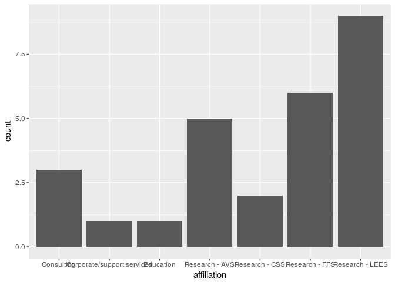
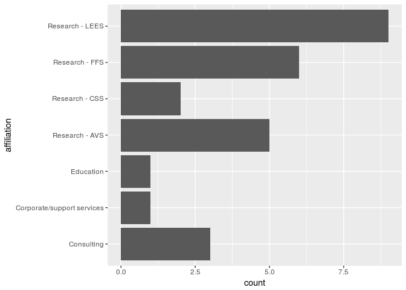
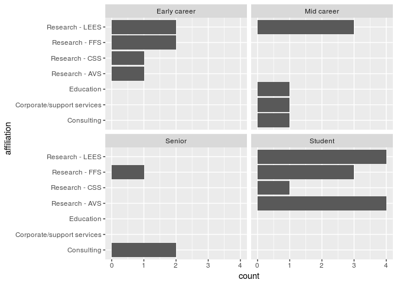
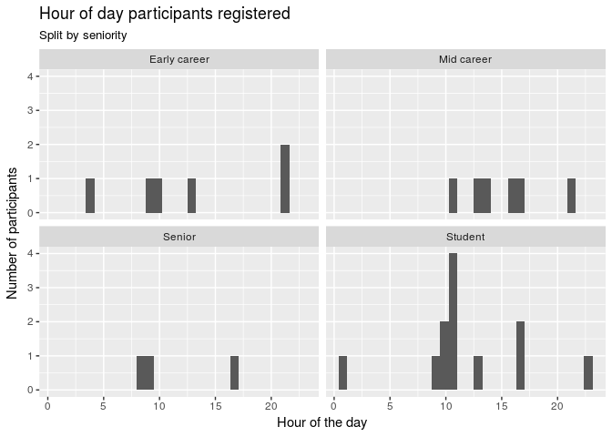
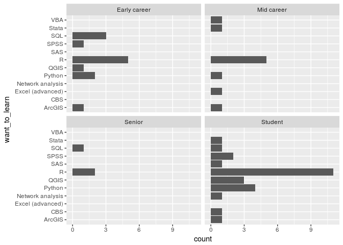
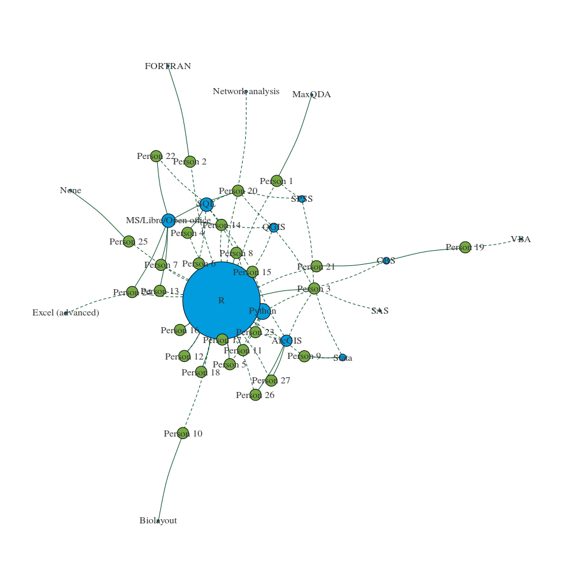

Data to a network visualisation
================
Mike Spencer
14 March 2018

Intro
-----

This document has been written in R and accompanies the live coding part of the network analysis workshop. In this document you'll see a mixture of code and output. Hopefully it'll be easy to tell these apart! To help, lines of output begin with `##`.

Packages
--------

-   Install only once
-   Load into session with `library()`

``` r
# install.packages("tidyverse")
# install.packages("igraph")

library(tidyverse)
```

    ## ── Attaching packages ───────────────────────────────────────────────────────────── tidyverse 1.2.1 ──

    ## ✔ ggplot2 2.2.1     ✔ purrr   0.2.4
    ## ✔ tibble  1.4.2     ✔ dplyr   0.7.4
    ## ✔ tidyr   0.8.0     ✔ stringr 1.2.0
    ## ✔ readr   1.1.1     ✔ forcats 0.2.0

    ## ── Conflicts ──────────────────────────────────────────────────────────────── tidyverse_conflicts() ──
    ## ✖ dplyr::filter() masks stats::filter()
    ## ✖ dplyr::lag()    masks stats::lag()

``` r
library(igraph)
```

    ## 
    ## Attaching package: 'igraph'

    ## The following objects are masked from 'package:dplyr':
    ## 
    ##     as_data_frame, groups, union

    ## The following objects are masked from 'package:purrr':
    ## 
    ##     compose, simplify

    ## The following object is masked from 'package:tidyr':
    ## 
    ##     crossing

    ## The following object is masked from 'package:tibble':
    ## 
    ##     as_data_frame

    ## The following objects are masked from 'package:stats':
    ## 
    ##     decompose, spectrum

    ## The following object is masked from 'package:base':
    ## 
    ##     union

Reading data
------------

We can read data from local files, but as you'll have seen in the workshop we can also read files from a web address.

``` r
# Reads and outputs to console
read_csv("../data/SNA_anon_delegates.csv")
```

    ## Parsed with column specification:
    ## cols(
    ##   Timestamp = col_character(),
    ##   `Your name` = col_character(),
    ##   `Your affiliation` = col_character(),
    ##   `Your seniority` = col_character(),
    ##   `Primary software expertise` = col_character(),
    ##   `I really want to learn...` = col_character()
    ## )

    ## # A tibble: 27 x 6
    ##    Timestamp           `Your name` `Your affiliation` `Your seniority`
    ##    <chr>               <chr>       <chr>              <chr>           
    ##  1 02/03/2018 21:44:54 Person 1    Research - AVS     Early career    
    ##  2 02/03/2018 21:47:45 Person 2    Research - LEES    Early career    
    ##  3 02/03/2018 23:03:18 Person 3    Research - FFS     Student         
    ##  4 03/03/2018 04:53:02 Person 4    Research - FFS     Early career    
    ##  5 03/03/2018 10:26:59 Person 5    Research - AVS     Student         
    ##  6 03/03/2018 10:32:22 Person 6    Research - FFS     Early career    
    ##  7 03/03/2018 11:56:24 Person 7    Research - AVS     Student         
    ##  8 03/03/2018 13:30:19 Person 8    Research - CSS     Early career    
    ##  9 03/03/2018 14:39:47 Person 9    Research - LEES    Mid career      
    ## 10 04/03/2018 08:48:31 Person 10   Research - FFS     Senior          
    ## # ... with 17 more rows, and 2 more variables: `Primary software
    ## #   expertise` <chr>, `I really want to learn...` <chr>

``` r
# Reads and assigns to object df
df = read_csv("../data/SNA_anon_delegates.csv")
```

    ## Parsed with column specification:
    ## cols(
    ##   Timestamp = col_character(),
    ##   `Your name` = col_character(),
    ##   `Your affiliation` = col_character(),
    ##   `Your seniority` = col_character(),
    ##   `Primary software expertise` = col_character(),
    ##   `I really want to learn...` = col_character()
    ## )

Cleaning data
-------------

This section prepares the dataset a little for exploratory analysis. It's worth noting here, that I've avoided tidying the `want_to_learn` columns at this point.

``` r
# Shortening and removing spaces from column names
colnames(df) = c("timestamp", "name", "affiliation", "seniority", "expertise", "want_to_learn")

# Reducing the long other answers
df$expertise[df$expertise=="Network analysis sofware like biolayout/Miru"] = "Biolayout"
df$expertise[df$expertise=="Excel (advanced)"] = "MS/Libre/Open office"
```

Selecting columns
-----------------

Particularly if we're working with large datasets, it can be useful to pull out the columns we're interested in.

``` r
# Data followed by columns we want
select(df, name, affiliation, seniority, expertise)
```

    ## # A tibble: 27 x 4
    ##    name      affiliation     seniority    expertise           
    ##    <chr>     <chr>           <chr>        <chr>               
    ##  1 Person 1  Research - AVS  Early career MaxQDA              
    ##  2 Person 2  Research - LEES Early career FORTRAN             
    ##  3 Person 3  Research - FFS  Student      R                   
    ##  4 Person 4  Research - FFS  Early career SQL                 
    ##  5 Person 5  Research - AVS  Student      R                   
    ##  6 Person 6  Research - FFS  Early career R                   
    ##  7 Person 7  Research - AVS  Student      MS/Libre/Open office
    ##  8 Person 8  Research - CSS  Early career R                   
    ##  9 Person 9  Research - LEES Mid career   Stata               
    ## 10 Person 10 Research - FFS  Senior       Biolayout           
    ## # ... with 17 more rows

``` r
# Or data followed by columns we don't want
select(df, -timestamp, -want_to_learn)
```

    ## # A tibble: 27 x 4
    ##    name      affiliation     seniority    expertise           
    ##    <chr>     <chr>           <chr>        <chr>               
    ##  1 Person 1  Research - AVS  Early career MaxQDA              
    ##  2 Person 2  Research - LEES Early career FORTRAN             
    ##  3 Person 3  Research - FFS  Student      R                   
    ##  4 Person 4  Research - FFS  Early career SQL                 
    ##  5 Person 5  Research - AVS  Student      R                   
    ##  6 Person 6  Research - FFS  Early career R                   
    ##  7 Person 7  Research - AVS  Student      MS/Libre/Open office
    ##  8 Person 8  Research - CSS  Early career R                   
    ##  9 Person 9  Research - LEES Mid career   Stata               
    ## 10 Person 10 Research - FFS  Senior       Biolayout           
    ## # ... with 17 more rows

Filter by row value
-------------------

What if we're not interested in every observation? Maybe we only want to look at those respondents from Land Economy, or find those with expertise in R.

``` r
# Single filter
filter(df, affiliation=="Research - LEES")
```

    ## # A tibble: 9 x 6
    ##   timestamp           name   affiliation seniority expertise want_to_learn
    ##   <chr>               <chr>  <chr>       <chr>     <chr>     <chr>        
    ## 1 02/03/2018 21:47:45 Perso… Research -… Early ca… FORTRAN   R            
    ## 2 03/03/2018 14:39:47 Perso… Research -… Mid care… Stata     R, Stata     
    ## 3 04/03/2018 13:03:34 Perso… Research -… Student   R         R, Python    
    ## 4 04/03/2018 21:56:33 Perso… Research -… Mid care… MS/Libre… R            
    ## 5 05/03/2018 09:25:32 Perso… Research -… Student   MS/Libre… R, QGIS      
    ## 6 05/03/2018 09:55:59 Perso… Research -… Early ca… R         SQL, R, Pyth…
    ## 7 05/03/2018 17:10:43 Perso… Research -… Student   MS/Libre… SQL, R, SPSS…
    ## 8 06/03/2018 17:10:11 Perso… Research -… Mid care… R         R, Python, A…
    ## 9 08/03/2018 01:25:19 Perso… Research -… Student   None      R

``` r
# Exclude
filter(df, expertise!="R")
```

    ## # A tibble: 16 x 6
    ##    timestamp           name  affiliation seniority expertise want_to_learn
    ##    <chr>               <chr> <chr>       <chr>     <chr>     <chr>        
    ##  1 02/03/2018 21:44:54 Pers… Research -… Early ca… MaxQDA    R, SPSS      
    ##  2 02/03/2018 21:47:45 Pers… Research -… Early ca… FORTRAN   R            
    ##  3 03/03/2018 04:53:02 Pers… Research -… Early ca… SQL       R            
    ##  4 03/03/2018 11:56:24 Pers… Research -… Student   MS/Libre… R            
    ##  5 03/03/2018 14:39:47 Pers… Research -… Mid care… Stata     R, Stata     
    ##  6 04/03/2018 08:48:31 Pers… Research -… Senior    Biolayout R            
    ##  7 04/03/2018 21:56:33 Pers… Research -… Mid care… MS/Libre… R            
    ##  8 05/03/2018 09:25:32 Pers… Research -… Student   MS/Libre… R, QGIS      
    ##  9 05/03/2018 11:46:48 Pers… Corporate/… Mid care… CBS       VBA          
    ## 10 05/03/2018 17:10:43 Pers… Research -… Student   MS/Libre… SQL, R, SPSS…
    ## 11 05/03/2018 17:42:18 Pers… Consulting  Senior    CBS       R            
    ## 12 06/03/2018 09:09:50 Pers… Consulting  Senior    MS/Libre… SQL          
    ## 13 07/03/2018 16:44:49 Pers… Consulting  Mid care… MS/Libre… R, Excel (ad…
    ## 14 08/03/2018 01:25:19 Pers… Research -… Student   None      R            
    ## 15 08/03/2018 13:15:20 Pers… Education   Mid care… ArcGIS    R            
    ## 16 15/03/2018 10:56:00 Pers… Research -… Student   ArcGIS    R

``` r
# Multiple filters? use & (and) or | (or)
filter(df, affiliation=="Research - LEES" & expertise=="R")
```

    ## # A tibble: 3 x 6
    ##   timestamp           name   affiliation seniority expertise want_to_learn
    ##   <chr>               <chr>  <chr>       <chr>     <chr>     <chr>        
    ## 1 04/03/2018 13:03:34 Perso… Research -… Student   R         R, Python    
    ## 2 05/03/2018 09:55:59 Perso… Research -… Early ca… R         SQL, R, Pyth…
    ## 3 06/03/2018 17:10:11 Perso… Research -… Mid care… R         R, Python, A…

``` r
# With a pipe
df %>% 
   select(-timestamp, -want_to_learn) %>% 
   filter(affiliation=="Research - LEES" & expertise=="R")
```

    ## # A tibble: 3 x 4
    ##   name      affiliation     seniority    expertise
    ##   <chr>     <chr>           <chr>        <chr>    
    ## 1 Person 11 Research - LEES Student      R        
    ## 2 Person 15 Research - LEES Early career R        
    ## 3 Person 23 Research - LEES Mid career   R

``` r
# With numbers
# filter(df, col_num==10)
# filter(df, col_num>10)
# etc.
# Note these commented lines of filter() are not run.
```

Summaries
---------

We often want to summarise our data. This may be simple counts of categories, or it may be numerical methods like taking a mean. The `count` command simply counts how many of each thing occur in a column.

If we want to do more than this we can use `summarise`, but in order to do this we need to tell R how to group our data. `group_by` tells R which column(s) to group our data on. If we had already cleaned our `want_to_learn` column into a tidy format (Wickham 2014 <http://vita.had.co.nz/papers/tidy-data.pdf>), most of our examples would have needed to use `group_by`.

``` r
# Basic how many?
count(df, expertise)
```

    ## # A tibble: 10 x 2
    ##    expertise                n
    ##    <chr>                <int>
    ##  1 ArcGIS                   2
    ##  2 Biolayout                1
    ##  3 CBS                      2
    ##  4 FORTRAN                  1
    ##  5 MaxQDA                   1
    ##  6 MS/Libre/Open office     6
    ##  7 None                     1
    ##  8 R                       11
    ##  9 SQL                      1
    ## 10 Stata                    1

``` r
# Ordered
df %>% 
   count(expertise) %>% 
   arrange(n)
```

    ## # A tibble: 10 x 2
    ##    expertise                n
    ##    <chr>                <int>
    ##  1 Biolayout                1
    ##  2 FORTRAN                  1
    ##  3 MaxQDA                   1
    ##  4 None                     1
    ##  5 SQL                      1
    ##  6 Stata                    1
    ##  7 ArcGIS                   2
    ##  8 CBS                      2
    ##  9 MS/Libre/Open office     6
    ## 10 R                       11

``` r
# By more categories we can use group_by
df %>% 
   group_by(seniority, expertise) %>% 
   summarise(n=n()) %>% 
   arrange(n)
```

    ## # A tibble: 16 x 3
    ## # Groups:   seniority [4]
    ##    seniority    expertise                n
    ##    <chr>        <chr>                <int>
    ##  1 Early career FORTRAN                  1
    ##  2 Early career MaxQDA                   1
    ##  3 Early career SQL                      1
    ##  4 Mid career   ArcGIS                   1
    ##  5 Mid career   CBS                      1
    ##  6 Mid career   R                        1
    ##  7 Mid career   Stata                    1
    ##  8 Senior       Biolayout                1
    ##  9 Senior       CBS                      1
    ## 10 Senior       MS/Libre/Open office     1
    ## 11 Student      ArcGIS                   1
    ## 12 Student      None                     1
    ## 13 Mid career   MS/Libre/Open office     2
    ## 14 Early career R                        3
    ## 15 Student      MS/Libre/Open office     3
    ## 16 Student      R                        7

``` r
# For a mean
# df %>% 
#   group_by(seniority, expertise) %>% 
#   summarise(mean_col1=mean(col1))
```

Plots
-----

R is *really* powerful for making plots. There are a number of ways to do this, we're going to use the `ggplot2` package. Have a look here <http://ggplot2.tidyverse.org/reference/> to give you an idea of some of the things we can do!

``` r
ggplot(df, aes(affiliation)) +
   geom_bar()
```



``` r
ggplot(df, aes(affiliation)) +
   geom_bar() +
   coord_flip()
```



``` r
ggplot(df, aes(affiliation)) +
   geom_bar() +
   coord_flip() +
   facet_wrap(~ seniority)
```



What time did you get up?
-------------------------

We can take the time stamps of registration and see how they spread across peoples' (self assessed) level of seniority. This is the tip of the iceberg on why data science can be considered intrusive. Note we can't really read anything into this as the sample sizes are very small.

Here we're introducing `mutate` to add extra variables.

``` r
# Extract the hour of registration from the timestamp column
df %>% 
   select(timestamp) %>% 
   mutate(hr=substr(timestamp, 12, 13))
```

    ## # A tibble: 27 x 2
    ##    timestamp           hr   
    ##    <chr>               <chr>
    ##  1 02/03/2018 21:44:54 21   
    ##  2 02/03/2018 21:47:45 21   
    ##  3 02/03/2018 23:03:18 23   
    ##  4 03/03/2018 04:53:02 04   
    ##  5 03/03/2018 10:26:59 10   
    ##  6 03/03/2018 10:32:22 10   
    ##  7 03/03/2018 11:56:24 11   
    ##  8 03/03/2018 13:30:19 13   
    ##  9 03/03/2018 14:39:47 14   
    ## 10 04/03/2018 08:48:31 08   
    ## # ... with 17 more rows

``` r
# As a number
x = df %>% 
   select(timestamp, seniority) %>% 
   mutate(hr=as.numeric(substr(timestamp, 12, 13)))

# All registrations
ggplot(x, aes(hr)) + 
   geom_histogram() +
   labs(title="Hour of day participants registered",
        x="Hour of the day",
        y="Number of participants")
```

    ## `stat_bin()` using `bins = 30`. Pick better value with `binwidth`.


``` r
# Split by seniority
ggplot(x, aes(hr)) + 
   geom_histogram() + 
   facet_wrap(~seniority) +
   labs(title="Hour of day participants registered",
        subtitle="Split by seniority",
        x="Hour of the day",
        y="Number of participants")
```

    ## `stat_bin()` using `bins = 30`. Pick better value with `binwidth`.



Tidy data
---------

The concept of tidy data is where each column is a variable and each row is an observation. It's worth repeating: Wickham 2014 is excellent <http://ggplot2.tidyverse.org/reference/>. Here we're going to use `str_count` to find out how many things each participant wants to learn and the split into separate columns.

``` r
# Maximum software types
n = str_count(df$want_to_learn, ",") %>% 
   max() + 1

# Wide not tidy data
df.learning = df %>% 
   select(name, want_to_learn) %>% 
   separate(want_to_learn, paste0("learn_", 1:n), sep=", ", fill="right")

# Tidy data
# Double thumbs up
df.learning = df %>% 
   select(name, want_to_learn) %>% 
   separate(want_to_learn, paste0("learn_", 1:n), sep=", ", fill="right") %>% 
   gather(ToDelete, want_to_learn, -name, na.rm=T) %>% 
   select(-ToDelete)
```

Joining data
------------

We've now got a separate, tidy, data frame of the software each person wants to learn. As required we can join this to our original data for use.

``` r
df %>% 
   select(name, seniority) %>% 
   inner_join(df.learning)
```

    ## Joining, by = "name"

    ## # A tibble: 52 x 3
    ##    name     seniority    want_to_learn
    ##    <chr>    <chr>        <chr>        
    ##  1 Person 1 Early career R            
    ##  2 Person 1 Early career SPSS         
    ##  3 Person 2 Early career R            
    ##  4 Person 3 Student      CBS          
    ##  5 Person 3 Student      Stata        
    ##  6 Person 3 Student      Python       
    ##  7 Person 3 Student      SPSS         
    ##  8 Person 3 Student      SAS          
    ##  9 Person 3 Student      QGIS         
    ## 10 Person 3 Student      ArcGIS       
    ## # ... with 42 more rows

``` r
df %>% 
   select(name, seniority) %>% 
   inner_join(df.learning) %>% 
   ggplot(aes(want_to_learn)) +
   geom_bar() +
   facet_wrap(~ seniority) +
   coord_flip()
```

    ## Joining, by = "name"



Basic network graph
-------------------

Show me the money! I know, the above doesn't look like network analysis at all, but its usefulness will hopefully become apparent.

This section moves on a lot from the earlier one. I would love there to be time to explain this code in detail, but we'll have to save that for another workshop.

The example below creates a bipartite graph, but with nodes showing the two tiers. In this case we're using people and seniority for our nodes/vertices.

``` r
# Make a data frame of edges
df.edges = df %>% 
   select(name, seniority)

# Make a data frame of vertices
# First create a vectors of unique people and seniority levels
x = data.frame(name=unique(df$seniority), size=20)
y = data.frame(name=df$name, size=5)

# Join these vectors together
df.vertices = rbind(x, y)

# Turn these into a graph data frame
df_graph = graph.data.frame(df.edges,
                            df.vertices,
                            directed=F)

# Plot our first graph!
plot(df_graph)
```


``` r
# Maybe different colours?
x = data.frame(name=unique(df$seniority), color="#75ab42", size=20)
y = data.frame(name=df$name, color="#75ab42", size=5)
df.vertices = rbind(x, y)
df_graph = graph.data.frame(df.edges,
                            df.vertices,
                            directed=F)
plot(df_graph,
     vertex.label.color="#333333")
```


Vertex size
-----------

But really, we might like our network to use parameters, or derived parameters to influence the way it looks. We can use the skills we learned during the earlier sections to do this.

``` r
# Get count of people
x = df %>% 
   count(seniority) %>% 
   mutate(name=seniority,
          color="#75ab42",
          size = n * 2) %>% 
   select(-n, -seniority)

y = data.frame(name=df$name, color="#75ab42", size=5)
df.vertices = rbind(x, y)
df_graph = graph.data.frame(df.edges,
                            df.vertices,
                            directed=F)
plot(df_graph,
     vertex.label.color="#333333")
```


Edge weight
-----------

We can also change our edge weight to show a variable. In this example I'm using the count of different software types someone wants to learn to weight the edge.

``` r
# Count software types for each person
# Make into our edges
df.edges = df %>% 
   select(name, seniority, want_to_learn) %>% 
   mutate(width=str_count(df$want_to_learn, ", ") + 1,
          color="#004b23") %>% 
   select(-want_to_learn)

# Vertices
x = df %>% 
   count(seniority) %>% 
   mutate(name=seniority, color="#75ab42", size = n * 2) %>% 
   select(-n, -seniority)
y = data.frame(name=df$name, color="#75ab42", size=5)
df.vertices = rbind(x, y)
df_graph = graph.data.frame(df.edges,
                            df.vertices,
                            directed=F)
plot(df_graph,
     vertex.label.color="#333333")
```


Putting these ideas together
----------------------------

We've some potentially useful data available here. Can we use it to make a diagram of where to go for help?

``` r
# Want to learn edges
x = df.learning %>% 
   select(name, want_to_learn) %>% 
   mutate(software=want_to_learn,
          lty=2,
          width=1,
          color="#004b23") %>% 
   select(-want_to_learn)
# Expertise edges
y = df %>% 
   select(name, expertise) %>% 
   mutate(software=expertise,
          lty=1,
          width=1,
          color="#004b23") %>% 
   select(-expertise)

df.edges = rbind(x, y)

# Vertices
x = df.edges %>% 
   count(software) %>% 
   mutate(name=software, color=rgb(0/255, 156/255, 222/255 ), size = n) %>% 
   select(-n, -software)
y = data.frame(name=df$name, color="#75ab42", size=5)
df.vertices = rbind(x, y)
df_graph = graph.data.frame(df.edges,
                            df.vertices,
                            directed=F)

par(mar=c(0.5, 0.5, 0.5, 0.5))
plot(df_graph,
     vertex.label.color="#333333",
     edge.curved=.1)
```



``` r
par(mar=c(5, 4, 4, 2) + 0.1)
```

Clearly more work to do to get the sizing right!
