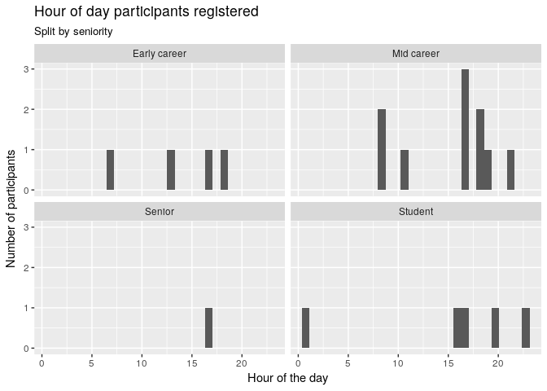

Data to a network visualisation
================
Mike Spencer
14 March 2018

Intro
-----

This document has been written in R and accompanies the live coding part of the network analysis workshop. In this document you'll see a mixture of code and output. Hopefully it'll be easy to tell these apart! To help, lines of output begin with `##`.

Packages
--------

-   Install only once
-   Load into session with `library()`

``` r
# install.packages("tidyverse")
# install.packages("igraph")

library(tidyverse)
```

    ## ── Attaching packages ────────────────────────────────────────────────────────────────────────── tidyverse 1.2.1 ──

    ## ✔ ggplot2 2.2.1     ✔ purrr   0.2.4
    ## ✔ tibble  1.3.4     ✔ dplyr   0.7.4
    ## ✔ tidyr   0.7.2     ✔ stringr 1.2.0
    ## ✔ readr   1.1.1     ✔ forcats 0.2.0

    ## ── Conflicts ───────────────────────────────────────────────────────────────────────────── tidyverse_conflicts() ──
    ## ✖ dplyr::filter() masks stats::filter()
    ## ✖ dplyr::lag()    masks stats::lag()

``` r
library(igraph)
```

    ## 
    ## Attaching package: 'igraph'

    ## The following objects are masked from 'package:dplyr':
    ## 
    ##     as_data_frame, groups, union

    ## The following objects are masked from 'package:purrr':
    ## 
    ##     compose, simplify

    ## The following object is masked from 'package:tidyr':
    ## 
    ##     crossing

    ## The following object is masked from 'package:tibble':
    ## 
    ##     as_data_frame

    ## The following objects are masked from 'package:stats':
    ## 
    ##     decompose, spectrum

    ## The following object is masked from 'package:base':
    ## 
    ##     union

Reading data
------------

We can read data from local files, but as you'll have seen in the workshop we can also read files from a web address.

``` r
# Reads and outputs to console
read_csv("../data/SNA_anon_delegates.csv")
```

    ## Parsed with column specification:
    ## cols(
    ##   Timestamp = col_character(),
    ##   `Your name` = col_character(),
    ##   `Your affiliation` = col_character(),
    ##   `Your seniority` = col_character(),
    ##   `Primary software expertise` = col_character(),
    ##   `I really want to learn...` = col_character()
    ## )

    ## # A tibble: 27 x 6
    ##              Timestamp `Your name` `Your affiliation` `Your seniority`
    ##                  <chr>       <chr>              <chr>            <chr>
    ##  1 02/03/2018 21:44:54    Person 1     Research - AVS     Early career
    ##  2 02/03/2018 21:47:45    Person 2    Research - LEES     Early career
    ##  3 02/03/2018 23:03:18    Person 3     Research - FFS          Student
    ##  4 03/03/2018 04:53:02    Person 4     Research - FFS     Early career
    ##  5 03/03/2018 10:26:59    Person 5     Research - AVS          Student
    ##  6 03/03/2018 10:32:22    Person 6     Research - FFS     Early career
    ##  7 03/03/2018 11:56:24    Person 7     Research - AVS          Student
    ##  8 03/03/2018 13:30:19    Person 8     Research - CSS     Early career
    ##  9 03/03/2018 14:39:47    Person 9    Research - LEES       Mid career
    ## 10 04/03/2018 08:48:31   Person 10     Research - FFS           Senior
    ## # ... with 17 more rows, and 2 more variables: `Primary software
    ## #   expertise` <chr>, `I really want to learn...` <chr>

``` r
# Reads and assigns to object df
df = read_csv("../data/SNA_anon_delegates.csv")
```

    ## Parsed with column specification:
    ## cols(
    ##   Timestamp = col_character(),
    ##   `Your name` = col_character(),
    ##   `Your affiliation` = col_character(),
    ##   `Your seniority` = col_character(),
    ##   `Primary software expertise` = col_character(),
    ##   `I really want to learn...` = col_character()
    ## )

Cleaning data
-------------

This section prepares the dataset a little for exploratory analysis. It's worth noting here, that I've avoided tidying the `want_to_learn` columns at this point.

``` r
# Shortening and removing spaces from column names
colnames(df) = c("timestamp", "name", "affiliation", "seniority", "expertise", "want_to_learn")

# Reducing the long other answers
df$expertise[df$expertise=="Network analysis sofware like biolayout/Miru"] = "Biolayout"
df$expertise[df$expertise=="Excel (advanced)"] = "MS/Libre/Open office"
```

Selecting columns
-----------------

Particularly if we're working with large datasets, it can be useful to pull out the columns we're interested in.

``` r
# Data followed by columns we want
select(df, name, affiliation, seniority, expertise)
```

    ## # A tibble: 27 x 4
    ##         name     affiliation    seniority            expertise
    ##        <chr>           <chr>        <chr>                <chr>
    ##  1  Person 1  Research - AVS Early career               MaxQDA
    ##  2  Person 2 Research - LEES Early career              FORTRAN
    ##  3  Person 3  Research - FFS      Student                    R
    ##  4  Person 4  Research - FFS Early career                  SQL
    ##  5  Person 5  Research - AVS      Student                    R
    ##  6  Person 6  Research - FFS Early career                    R
    ##  7  Person 7  Research - AVS      Student MS/Libre/Open office
    ##  8  Person 8  Research - CSS Early career                    R
    ##  9  Person 9 Research - LEES   Mid career                Stata
    ## 10 Person 10  Research - FFS       Senior            Biolayout
    ## # ... with 17 more rows

``` r
# Or data followed by columns we don't want
select(df, -timestamp, -want_to_learn)
```

    ## # A tibble: 27 x 4
    ##         name     affiliation    seniority            expertise
    ##        <chr>           <chr>        <chr>                <chr>
    ##  1  Person 1  Research - AVS Early career               MaxQDA
    ##  2  Person 2 Research - LEES Early career              FORTRAN
    ##  3  Person 3  Research - FFS      Student                    R
    ##  4  Person 4  Research - FFS Early career                  SQL
    ##  5  Person 5  Research - AVS      Student                    R
    ##  6  Person 6  Research - FFS Early career                    R
    ##  7  Person 7  Research - AVS      Student MS/Libre/Open office
    ##  8  Person 8  Research - CSS Early career                    R
    ##  9  Person 9 Research - LEES   Mid career                Stata
    ## 10 Person 10  Research - FFS       Senior            Biolayout
    ## # ... with 17 more rows

Filter by row value
-------------------

What if we're not interested in every observation? Maybe we only want to look at those respondents from Land Economy, or find those with expertise in R.

``` r
# Single filter
filter(df, affiliation=="Research - LEES")
```

    ## # A tibble: 9 x 6
    ##             timestamp      name     affiliation    seniority
    ##                 <chr>     <chr>           <chr>        <chr>
    ## 1 02/03/2018 21:47:45  Person 2 Research - LEES Early career
    ## 2 03/03/2018 14:39:47  Person 9 Research - LEES   Mid career
    ## 3 04/03/2018 13:03:34 Person 11 Research - LEES      Student
    ## 4 04/03/2018 21:56:33 Person 13 Research - LEES   Mid career
    ## 5 05/03/2018 09:25:32 Person 14 Research - LEES      Student
    ## 6 05/03/2018 09:55:59 Person 15 Research - LEES Early career
    ## 7 05/03/2018 17:10:43 Person 20 Research - LEES      Student
    ## 8 06/03/2018 17:10:11 Person 23 Research - LEES   Mid career
    ## 9 08/03/2018 01:25:19 Person 25 Research - LEES      Student
    ## # ... with 2 more variables: expertise <chr>, want_to_learn <chr>

``` r
# Exclude
filter(df, expertise!="R")
```

    ## # A tibble: 16 x 6
    ##              timestamp      name                affiliation    seniority
    ##                  <chr>     <chr>                      <chr>        <chr>
    ##  1 02/03/2018 21:44:54  Person 1             Research - AVS Early career
    ##  2 02/03/2018 21:47:45  Person 2            Research - LEES Early career
    ##  3 03/03/2018 04:53:02  Person 4             Research - FFS Early career
    ##  4 03/03/2018 11:56:24  Person 7             Research - AVS      Student
    ##  5 03/03/2018 14:39:47  Person 9            Research - LEES   Mid career
    ##  6 04/03/2018 08:48:31 Person 10             Research - FFS       Senior
    ##  7 04/03/2018 21:56:33 Person 13            Research - LEES   Mid career
    ##  8 05/03/2018 09:25:32 Person 14            Research - LEES      Student
    ##  9 05/03/2018 11:46:48 Person 19 Corporate/support services   Mid career
    ## 10 05/03/2018 17:10:43 Person 20            Research - LEES      Student
    ## 11 05/03/2018 17:42:18 Person 21                 Consulting       Senior
    ## 12 06/03/2018 09:09:50 Person 22                 Consulting       Senior
    ## 13 07/03/2018 16:44:49 Person 24                 Consulting   Mid career
    ## 14 08/03/2018 01:25:19 Person 25            Research - LEES      Student
    ## 15 08/03/2018 13:15:20 Person 26                  Education   Mid career
    ## 16 15/03/2018 10:56:00 Person 27             Research - CSS      Student
    ## # ... with 2 more variables: expertise <chr>, want_to_learn <chr>

``` r
# Multiple filters? use & (and) or | (or)
filter(df, affiliation=="Research - LEES" & expertise=="R")
```

    ## # A tibble: 3 x 6
    ##             timestamp      name     affiliation    seniority expertise
    ##                 <chr>     <chr>           <chr>        <chr>     <chr>
    ## 1 04/03/2018 13:03:34 Person 11 Research - LEES      Student         R
    ## 2 05/03/2018 09:55:59 Person 15 Research - LEES Early career         R
    ## 3 06/03/2018 17:10:11 Person 23 Research - LEES   Mid career         R
    ## # ... with 1 more variables: want_to_learn <chr>

``` r
# With a pipe
df %>% 
   select(-timestamp, -want_to_learn) %>% 
   filter(affiliation=="Research - LEES" & expertise=="R")
```

    ## # A tibble: 3 x 4
    ##        name     affiliation    seniority expertise
    ##       <chr>           <chr>        <chr>     <chr>
    ## 1 Person 11 Research - LEES      Student         R
    ## 2 Person 15 Research - LEES Early career         R
    ## 3 Person 23 Research - LEES   Mid career         R

``` r
# With numbers
# filter(df, col_num==10)
# filter(df, col_num>10)
# etc.
# Note these commented lines of filter() are not run.
```

Summaries
---------

We often want to summarise our data. This may be simple counts of categories, or it may be numerical methods like taking a mean. The `count` command simply counts how many of each thing occur in a column.

If we want to do more than this we can use `summarise`, but in order to do this we need to tell R how to group our data. `group_by` tells R which column(s) to group our data on. If we had already cleaned our `want_to_learn` column into a tidy format (Wickham 2014 <http://vita.had.co.nz/papers/tidy-data.pdf>), most of our examples would have needed to use `group_by`.

``` r
# Basic how many?
count(df, expertise)
```

    ## # A tibble: 10 x 2
    ##               expertise     n
    ##                   <chr> <int>
    ##  1               ArcGIS     2
    ##  2            Biolayout     1
    ##  3                  CBS     2
    ##  4              FORTRAN     1
    ##  5               MaxQDA     1
    ##  6 MS/Libre/Open office     6
    ##  7                 None     1
    ##  8                    R    11
    ##  9                  SQL     1
    ## 10                Stata     1

``` r
# Ordered
df %>% 
   count(expertise) %>% 
   arrange(n)
```

    ## # A tibble: 10 x 2
    ##               expertise     n
    ##                   <chr> <int>
    ##  1            Biolayout     1
    ##  2              FORTRAN     1
    ##  3               MaxQDA     1
    ##  4                 None     1
    ##  5                  SQL     1
    ##  6                Stata     1
    ##  7               ArcGIS     2
    ##  8                  CBS     2
    ##  9 MS/Libre/Open office     6
    ## 10                    R    11

``` r
# By more categories we can use group_by
df %>% 
   group_by(seniority, expertise) %>% 
   summarise(n=n()) %>% 
   arrange(n)
```

    ## # A tibble: 16 x 3
    ## # Groups:   seniority [4]
    ##       seniority            expertise     n
    ##           <chr>                <chr> <int>
    ##  1 Early career              FORTRAN     1
    ##  2 Early career               MaxQDA     1
    ##  3 Early career                  SQL     1
    ##  4   Mid career               ArcGIS     1
    ##  5   Mid career                  CBS     1
    ##  6   Mid career                    R     1
    ##  7   Mid career                Stata     1
    ##  8       Senior            Biolayout     1
    ##  9       Senior                  CBS     1
    ## 10       Senior MS/Libre/Open office     1
    ## 11      Student               ArcGIS     1
    ## 12      Student                 None     1
    ## 13   Mid career MS/Libre/Open office     2
    ## 14 Early career                    R     3
    ## 15      Student MS/Libre/Open office     3
    ## 16      Student                    R     7

``` r
# For a mean
# df %>% 
#   group_by(seniority, expertise) %>% 
#   summarise(mean_col1=mean(col1))
```

Plots
-----

R is *really* powerful for making plots. There are a number of ways to do this, we're going to use the `ggplot2` package. Have a look here <http://ggplot2.tidyverse.org/reference/> to give you an idea of some of the things we can do!

``` r
ggplot(df, aes(affiliation)) +
   geom_bar()
```


``` r
ggplot(df, aes(affiliation)) +
   geom_bar() +
   coord_flip()
```


``` r
ggplot(df, aes(affiliation)) +
   geom_bar() +
   coord_flip() +
   facet_wrap(~ seniority)
```


What time did you get up?
-------------------------

We can take the time stamps of registration and see how they spread across peoples' (self assessed) level of seniority. This is the tip of the iceberg on why data science can be considered intrusive. Note we can't really read anything into this as the sample sizes are very small.

``` r
df$hr = substr(df$timestamp, 12, 13)
df$hr = as.numeric(df$hr)

# All registrations
ggplot(df, aes(hr)) + 
   geom_histogram() +
   labs(title="Hour of day participants registered",
        x="Hour of the day",
        y="Number of participants")
```

    ## `stat_bin()` using `bins = 30`. Pick better value with `binwidth`.


``` r
ggplot(df, aes(hr)) + 
   geom_histogram() + 
   facet_wrap(~seniority) +
   labs(title="Hour of day participants registered",
        subtitle="Split by seniority",
        x="Hour of the day",
        y="Number of participants")
```

    ## `stat_bin()` using `bins = 30`. Pick better value with `binwidth`.


