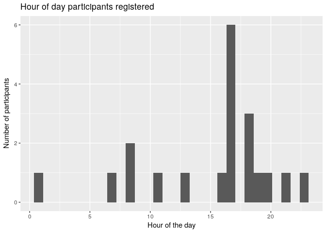
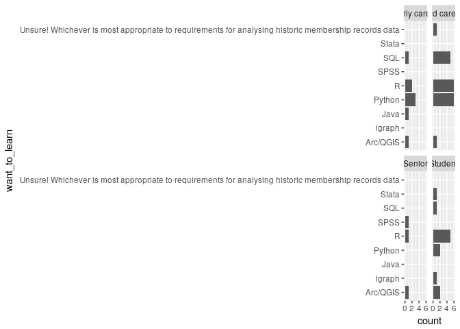
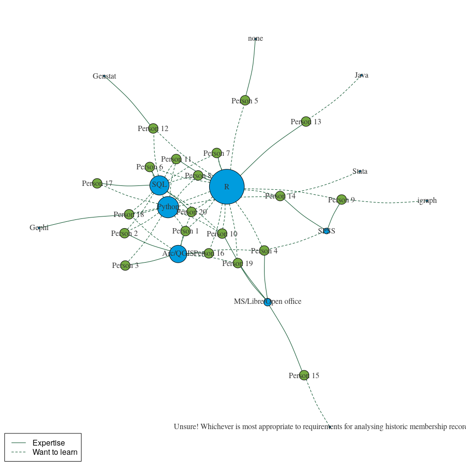

Data to a network visualisation
================
Mike Spencer
14 March 2018

Intro
-----

This document has been written in R and accompanies the live coding part of the network analysis workshop. In this document you'll see a mixture of code and output. Hopefully it'll be easy to tell these apart! To help, lines of output begin with `##`.

Packages
--------

-   Install only once
-   Load into session with `library()`

``` r
# install.packages("tidyverse")
# install.packages("igraph")

library(tidyverse)
```

    ## ── Attaching packages ────────────────────────────────────────────────────────────────────────── tidyverse 1.2.1 ──

    ## ✔ ggplot2 2.2.1     ✔ purrr   0.2.4
    ## ✔ tibble  1.3.4     ✔ dplyr   0.7.4
    ## ✔ tidyr   0.7.2     ✔ stringr 1.2.0
    ## ✔ readr   1.1.1     ✔ forcats 0.2.0

    ## ── Conflicts ───────────────────────────────────────────────────────────────────────────── tidyverse_conflicts() ──
    ## ✖ dplyr::filter() masks stats::filter()
    ## ✖ dplyr::lag()    masks stats::lag()

``` r
library(igraph)
```

    ## 
    ## Attaching package: 'igraph'

    ## The following objects are masked from 'package:dplyr':
    ## 
    ##     as_data_frame, groups, union

    ## The following objects are masked from 'package:purrr':
    ## 
    ##     compose, simplify

    ## The following object is masked from 'package:tidyr':
    ## 
    ##     crossing

    ## The following object is masked from 'package:tibble':
    ## 
    ##     as_data_frame

    ## The following objects are masked from 'package:stats':
    ## 
    ##     decompose, spectrum

    ## The following object is masked from 'package:base':
    ## 
    ##     union

Reading data
------------

We can read data from local files, but as you'll have seen in the workshop we can also read files from a web address.

``` r
# Reads and outputs to console
read_csv("https://raw.githubusercontent.com/SRUC-CPD/network-intro/master/data/SNA_anon_delegates.csv")
```

    ## Parsed with column specification:
    ## cols(
    ##   Timestamp = col_character(),
    ##   `Your name` = col_character(),
    ##   `Your sector` = col_character(),
    ##   `Your seniority` = col_character(),
    ##   `Primary software expertise` = col_character(),
    ##   `I really want to learn...` = col_character()
    ## )

    ## # A tibble: 20 x 6
    ##              Timestamp `Your name`  `Your sector` `Your seniority`
    ##                  <chr>       <chr>          <chr>            <chr>
    ##  1 19/03/2018 17:13:18    Person 1 Private sector       Mid career
    ##  2 19/03/2018 17:15:46    Person 2  Public sector     Early career
    ##  3 19/03/2018 17:16:17    Person 3  Public sector       Mid career
    ##  4 19/03/2018 17:23:06    Person 4   Third sector           Senior
    ##  5 19/03/2018 17:54:26    Person 5       Academic          Student
    ##  6 19/03/2018 18:12:38    Person 6 Private sector     Early career
    ##  7 19/03/2018 18:33:53    Person 7      Education       Mid career
    ##  8 19/03/2018 18:37:37    Person 8 Private sector       Mid career
    ##  9 19/03/2018 20:29:12    Person 9       Academic          Student
    ## 10 19/03/2018 21:35:58   Person 10      Education       Mid career
    ## 11 20/03/2018 08:34:19   Person 11  Public sector       Mid career
    ## 12 20/03/2018 11:54:49   Person 12       Academic       Mid career
    ## 13 20/03/2018 13:52:30   Person 13       Academic     Early career
    ## 14 20/03/2018 16:27:12   Person 14       Academic          Student
    ## 15 21/03/2018 08:57:04   Person 15 Private sector       Mid career
    ## 16 21/03/2018 17:22:52   Person 16  Public sector       Mid career
    ## 17 21/03/2018 19:30:25   Person 17 Private sector       Mid career
    ## 18 21/03/2018 23:39:52   Person 18       Academic          Student
    ## 19 22/03/2018 01:54:49   Person 19       Academic          Student
    ## 20 22/03/2018 07:37:45   Person 20  Public sector     Early career
    ## # ... with 2 more variables: `Primary software expertise` <chr>, `I really
    ## #   want to learn...` <chr>

``` r
# Reads and assigns to object df
df = read_csv("https://raw.githubusercontent.com/SRUC-CPD/network-intro/master/data/SNA_anon_delegates.csv")
```

    ## Parsed with column specification:
    ## cols(
    ##   Timestamp = col_character(),
    ##   `Your name` = col_character(),
    ##   `Your sector` = col_character(),
    ##   `Your seniority` = col_character(),
    ##   `Primary software expertise` = col_character(),
    ##   `I really want to learn...` = col_character()
    ## )

Cleaning data
-------------

This section prepares the dataset a little for exploratory analysis. It's worth noting here, that I've avoided tidying the `want_to_learn` columns at this point.

``` r
# Shortening and removing spaces from column names
colnames(df) = c("timestamp", "name", "sector", "seniority", "expertise", "want_to_learn")

# Reducing the long other answers
df$expertise[df$expertise=="I'm assuming MS is Microsoft Office?"] = "MS/Libre/Open office"
```

Selecting columns
-----------------

Particularly if we're working with large datasets, it can be useful to pull out the columns we're interested in.

``` r
# Data followed by columns we want
select(df, name, sector, seniority, expertise)
```

    ## # A tibble: 20 x 4
    ##         name         sector    seniority            expertise
    ##        <chr>          <chr>        <chr>                <chr>
    ##  1  Person 1 Private sector   Mid career             Arc/QGIS
    ##  2  Person 2  Public sector Early career             Arc/QGIS
    ##  3  Person 3  Public sector   Mid career             Arc/QGIS
    ##  4  Person 4   Third sector       Senior MS/Libre/Open office
    ##  5  Person 5       Academic      Student                 none
    ##  6  Person 6 Private sector Early career                  SQL
    ##  7  Person 7      Education   Mid career                    R
    ##  8  Person 8 Private sector   Mid career                    R
    ##  9  Person 9       Academic      Student                 SPSS
    ## 10 Person 10      Education   Mid career MS/Libre/Open office
    ## 11 Person 11  Public sector   Mid career                    R
    ## 12 Person 12       Academic   Mid career              Genstat
    ## 13 Person 13       Academic Early career                    R
    ## 14 Person 14       Academic      Student                 SPSS
    ## 15 Person 15 Private sector   Mid career MS/Libre/Open office
    ## 16 Person 16  Public sector   Mid career             Arc/QGIS
    ## 17 Person 17 Private sector   Mid career                  SQL
    ## 18 Person 18       Academic      Student                Gephi
    ## 19 Person 19       Academic      Student MS/Libre/Open office
    ## 20 Person 20  Public sector Early career                  SQL

``` r
# Or data followed by columns we don't want
select(df, -timestamp, -want_to_learn)
```

    ## # A tibble: 20 x 4
    ##         name         sector    seniority            expertise
    ##        <chr>          <chr>        <chr>                <chr>
    ##  1  Person 1 Private sector   Mid career             Arc/QGIS
    ##  2  Person 2  Public sector Early career             Arc/QGIS
    ##  3  Person 3  Public sector   Mid career             Arc/QGIS
    ##  4  Person 4   Third sector       Senior MS/Libre/Open office
    ##  5  Person 5       Academic      Student                 none
    ##  6  Person 6 Private sector Early career                  SQL
    ##  7  Person 7      Education   Mid career                    R
    ##  8  Person 8 Private sector   Mid career                    R
    ##  9  Person 9       Academic      Student                 SPSS
    ## 10 Person 10      Education   Mid career MS/Libre/Open office
    ## 11 Person 11  Public sector   Mid career                    R
    ## 12 Person 12       Academic   Mid career              Genstat
    ## 13 Person 13       Academic Early career                    R
    ## 14 Person 14       Academic      Student                 SPSS
    ## 15 Person 15 Private sector   Mid career MS/Libre/Open office
    ## 16 Person 16  Public sector   Mid career             Arc/QGIS
    ## 17 Person 17 Private sector   Mid career                  SQL
    ## 18 Person 18       Academic      Student                Gephi
    ## 19 Person 19       Academic      Student MS/Libre/Open office
    ## 20 Person 20  Public sector Early career                  SQL

Filter by row value
-------------------

What if we're not interested in every observation? Maybe we only want to look at those respondents from Land Economy, or find those with expertise in R.

``` r
# Single filter
filter(df, sector=="Private sector")
```

    ## # A tibble: 5 x 6
    ##             timestamp      name         sector    seniority
    ##                 <chr>     <chr>          <chr>        <chr>
    ## 1 19/03/2018 17:13:18  Person 1 Private sector   Mid career
    ## 2 19/03/2018 18:12:38  Person 6 Private sector Early career
    ## 3 19/03/2018 18:37:37  Person 8 Private sector   Mid career
    ## 4 21/03/2018 08:57:04 Person 15 Private sector   Mid career
    ## 5 21/03/2018 19:30:25 Person 17 Private sector   Mid career
    ## # ... with 2 more variables: expertise <chr>, want_to_learn <chr>

``` r
# Exclude
filter(df, expertise!="R")
```

    ## # A tibble: 16 x 6
    ##              timestamp      name         sector    seniority
    ##                  <chr>     <chr>          <chr>        <chr>
    ##  1 19/03/2018 17:13:18  Person 1 Private sector   Mid career
    ##  2 19/03/2018 17:15:46  Person 2  Public sector Early career
    ##  3 19/03/2018 17:16:17  Person 3  Public sector   Mid career
    ##  4 19/03/2018 17:23:06  Person 4   Third sector       Senior
    ##  5 19/03/2018 17:54:26  Person 5       Academic      Student
    ##  6 19/03/2018 18:12:38  Person 6 Private sector Early career
    ##  7 19/03/2018 20:29:12  Person 9       Academic      Student
    ##  8 19/03/2018 21:35:58 Person 10      Education   Mid career
    ##  9 20/03/2018 11:54:49 Person 12       Academic   Mid career
    ## 10 20/03/2018 16:27:12 Person 14       Academic      Student
    ## 11 21/03/2018 08:57:04 Person 15 Private sector   Mid career
    ## 12 21/03/2018 17:22:52 Person 16  Public sector   Mid career
    ## 13 21/03/2018 19:30:25 Person 17 Private sector   Mid career
    ## 14 21/03/2018 23:39:52 Person 18       Academic      Student
    ## 15 22/03/2018 01:54:49 Person 19       Academic      Student
    ## 16 22/03/2018 07:37:45 Person 20  Public sector Early career
    ## # ... with 2 more variables: expertise <chr>, want_to_learn <chr>

``` r
# Multiple filters? use & (and) or | (or)
filter(df, sector=="Private sector" & expertise=="R")
```

    ## # A tibble: 1 x 6
    ##             timestamp     name         sector  seniority expertise
    ##                 <chr>    <chr>          <chr>      <chr>     <chr>
    ## 1 19/03/2018 18:37:37 Person 8 Private sector Mid career         R
    ## # ... with 1 more variables: want_to_learn <chr>

``` r
# With a pipe
df %>% 
   select(-timestamp, -want_to_learn) %>% 
   filter(sector=="Private sector" & expertise=="R")
```

    ## # A tibble: 1 x 4
    ##       name         sector  seniority expertise
    ##      <chr>          <chr>      <chr>     <chr>
    ## 1 Person 8 Private sector Mid career         R

``` r
# With numbers
# filter(df, col_num==10)
# filter(df, col_num>10)
# etc.
# Note these commented lines of filter() are not run.
```

Summaries
---------

We often want to summarise our data. This may be simple counts of categories, or it may be numerical methods like taking a mean. The `count` command simply counts how many of each thing occur in a column.

If we want to do more than this we can use `summarise`, but in order to do this we need to tell R how to group our data. `group_by` tells R which column(s) to group our data on. If we had already cleaned our `want_to_learn` column into a tidy format (Wickham 2014 <http://vita.had.co.nz/papers/tidy-data.pdf>), most of our examples would have needed to use `group_by`.

``` r
# Basic how many?
count(df, expertise)
```

    ## # A tibble: 8 x 2
    ##              expertise     n
    ##                  <chr> <int>
    ## 1             Arc/QGIS     4
    ## 2              Genstat     1
    ## 3                Gephi     1
    ## 4 MS/Libre/Open office     4
    ## 5                 none     1
    ## 6                    R     4
    ## 7                 SPSS     2
    ## 8                  SQL     3

``` r
# Ordered
df %>% 
   count(expertise) %>% 
   arrange(n)
```

    ## # A tibble: 8 x 2
    ##              expertise     n
    ##                  <chr> <int>
    ## 1              Genstat     1
    ## 2                Gephi     1
    ## 3                 none     1
    ## 4                 SPSS     2
    ## 5                  SQL     3
    ## 6             Arc/QGIS     4
    ## 7 MS/Libre/Open office     4
    ## 8                    R     4

``` r
# By more categories we can use group_by
df %>% 
   group_by(seniority, expertise) %>% 
   summarise(n=n()) %>% 
   arrange(n)
```

    ## # A tibble: 13 x 3
    ## # Groups:   seniority [4]
    ##       seniority            expertise     n
    ##           <chr>                <chr> <int>
    ##  1 Early career             Arc/QGIS     1
    ##  2 Early career                    R     1
    ##  3   Mid career              Genstat     1
    ##  4   Mid career                  SQL     1
    ##  5       Senior MS/Libre/Open office     1
    ##  6      Student                Gephi     1
    ##  7      Student MS/Libre/Open office     1
    ##  8      Student                 none     1
    ##  9 Early career                  SQL     2
    ## 10   Mid career MS/Libre/Open office     2
    ## 11      Student                 SPSS     2
    ## 12   Mid career             Arc/QGIS     3
    ## 13   Mid career                    R     3

``` r
# For a mean
# df %>% 
#   group_by(seniority, expertise) %>% 
#   summarise(mean_col1=mean(col1))
```

Plots
-----

R is *really* powerful for making plots. There are a number of ways to do this, we're going to use the `ggplot2` package. Have a look here <http://ggplot2.tidyverse.org/reference/> to give you an idea of some of the things we can do!

``` r
ggplot(df, aes(sector)) +
   geom_bar()
```


``` r
ggplot(df, aes(sector)) +
   geom_bar() +
   coord_flip()
```


``` r
ggplot(df, aes(sector)) +
   geom_bar() +
   coord_flip() +
   facet_wrap(~ seniority)
```


Creepy Data Science
-------------------

We can take the time stamps of registration and see how they spread across peoples' (self assessed) level of seniority. This is the tip of the iceberg on why data science can be considered intrusive. Note we can't really read anything into this as the sample sizes are very small.

Here we're introducing `mutate` to add extra variables.

``` r
# Extract the hour of registration from the timestamp column
df %>% 
   select(timestamp) %>% 
   mutate(hr=substr(timestamp, 12, 13))
```

    ## # A tibble: 20 x 2
    ##              timestamp    hr
    ##                  <chr> <chr>
    ##  1 19/03/2018 17:13:18    17
    ##  2 19/03/2018 17:15:46    17
    ##  3 19/03/2018 17:16:17    17
    ##  4 19/03/2018 17:23:06    17
    ##  5 19/03/2018 17:54:26    17
    ##  6 19/03/2018 18:12:38    18
    ##  7 19/03/2018 18:33:53    18
    ##  8 19/03/2018 18:37:37    18
    ##  9 19/03/2018 20:29:12    20
    ## 10 19/03/2018 21:35:58    21
    ## 11 20/03/2018 08:34:19    08
    ## 12 20/03/2018 11:54:49    11
    ## 13 20/03/2018 13:52:30    13
    ## 14 20/03/2018 16:27:12    16
    ## 15 21/03/2018 08:57:04    08
    ## 16 21/03/2018 17:22:52    17
    ## 17 21/03/2018 19:30:25    19
    ## 18 21/03/2018 23:39:52    23
    ## 19 22/03/2018 01:54:49    01
    ## 20 22/03/2018 07:37:45    07

``` r
# As a number
x = df %>% 
   select(timestamp, seniority) %>% 
   mutate(hr=as.numeric(substr(timestamp, 12, 13)))

# All registrations
ggplot(x, aes(hr)) + 
   geom_histogram() +
   labs(title="Hour of day participants registered",
        x="Hour of the day",
        y="Number of participants")
```

    ## `stat_bin()` using `bins = 30`. Pick better value with `binwidth`.



``` r
# Split by seniority
ggplot(x, aes(hr)) + 
   geom_histogram() + 
   facet_wrap(~seniority) +
   labs(title="Hour of day participants registered",
        subtitle="Split by seniority",
        x="Hour of the day",
        y="Number of participants")
```

    ## `stat_bin()` using `bins = 30`. Pick better value with `binwidth`.


Tidy data
---------

The concept of tidy data is where each column is a variable and each row is an observation. It's worth repeating: Wickham 2014 is excellent <http://vita.had.co.nz/papers/tidy-data.pdf>. Here we're going to use `str_count` to find out how many things each participant wants to learn and the split into separate columns.

``` r
# Maximum software types
n = str_count(df$want_to_learn, ",") %>% 
   max() + 1

# Wide not tidy data
df.learning = df %>% 
   select(name, want_to_learn) %>% 
   separate(want_to_learn, paste0("learn_", 1:n), sep=", ", fill="right")

# Tidy data
# Double thumbs up
df.learning = df %>% 
   select(name, want_to_learn) %>% 
   separate(want_to_learn, paste0("learn_", 1:n), sep=", ", fill="right") %>% 
   gather(ToDelete, want_to_learn, -name, na.rm=T) %>% 
   select(-ToDelete)
```

Joining data
------------

We've now got a separate, tidy, data frame of the software each person wants to learn. As required we can join this to our original data for use.

``` r
df %>% 
   select(name, seniority) %>% 
   inner_join(df.learning)
```

    ## Joining, by = "name"

    ## # A tibble: 42 x 3
    ##        name    seniority want_to_learn
    ##       <chr>        <chr>         <chr>
    ##  1 Person 1   Mid career        Python
    ##  2 Person 1   Mid career             R
    ##  3 Person 2 Early career        Python
    ##  4 Person 2 Early career           SQL
    ##  5 Person 3   Mid career        Python
    ##  6 Person 4       Senior      Arc/QGIS
    ##  7 Person 4       Senior             R
    ##  8 Person 4       Senior          SPSS
    ##  9 Person 5      Student             R
    ## 10 Person 6 Early career        Python
    ## # ... with 32 more rows

``` r
df %>% 
   select(name, seniority) %>% 
   inner_join(df.learning) %>% 
   ggplot(aes(want_to_learn)) +
   geom_bar() +
   facet_wrap(~ seniority) +
   coord_flip()
```

    ## Joining, by = "name"



Basic network graph
-------------------

Show me the money! I know, the above doesn't look like network analysis at all, but its usefulness will hopefully become apparent.

This section moves on a lot from the earlier one. I would love there to be time to explain this code in detail, but we'll have to save that for another workshop.

The example below creates a bipartite graph, but with nodes showing the two tiers. In this case we're using people and seniority for our nodes/vertices.

``` r
# Make a data frame of edges
df.edges = df %>% 
   select(name, seniority)

# Make a data frame of vertices
# First create a vectors of unique people and seniority levels
x = df %>% 
   distinct(seniority) %>% 
   mutate(name=seniority, size=20) %>% 
   select(-seniority)

y = df %>% 
   select(name) %>% 
   mutate(size=5)

# Join these vectors together
df.vertices = rbind(x, y)

# Turn these into a graph data frame
df_graph = graph.data.frame(df.edges,
                            df.vertices,
                            directed=F)

# Plot our first graph!
plot(df_graph)
```


``` r
# Maybe different colours?
x = data.frame(name=unique(df$seniority), color="#75ab42", size=20)
y = data.frame(name=df$name, color="#75ab42", size=5)
df.vertices = rbind(x, y)
df_graph = graph.data.frame(df.edges,
                            df.vertices,
                            directed=F)
plot(df_graph,
     vertex.label.color="#333333")
```


Vertex size
-----------

But really, we might like our network to use parameters, or derived parameters to influence the way it looks. We can use the skills we learned during the earlier sections to do this.

``` r
# Get count of people
x = df %>% 
   count(seniority) %>% 
   mutate(name=seniority,
          color="#75ab42",
          size = n * 2) %>% 
   select(-n, -seniority)

y = df %>% 
   select(name) %>% 
   mutate(size=5, color="#75ab42")

df.vertices = rbind(x, y)
df_graph = graph.data.frame(df.edges,
                            df.vertices,
                            directed=F)
plot(df_graph,
     vertex.label.color="#333333")
```


Edge weight
-----------

We can also change our edge weight to show a variable. In this example I'm using the count of different software types someone wants to learn to weight the edge.

``` r
# Count software types for each person
# Make into our edges
df.edges = df %>% 
   select(name, seniority, want_to_learn) %>% 
   mutate(width=str_count(df$want_to_learn, ", ") + 1,
          color="#004b23") %>% 
   select(-want_to_learn)

# Vertices
x = df %>% 
   count(seniority) %>% 
   mutate(name=seniority, color="#75ab42", size = n * 2) %>% 
   select(-n, -seniority)
y = df %>% 
   select(name) %>% 
   mutate(size=5, color="#75ab42")
df.vertices = rbind(x, y)
df_graph = graph.data.frame(df.edges,
                            df.vertices,
                            directed=F)
plot(df_graph,
     vertex.label.color="#333333")
```


Putting these ideas together
----------------------------

We've some potentially useful data available here. Can we use it to make a diagram of where to go for help? Here we use `lty` to change the line type, use `?par` and search for `lty` to see other options.

``` r
# Want to learn edges
x = df.learning %>% 
   select(name, want_to_learn) %>% 
   mutate(software=want_to_learn,
          lty=2,
          width=1,
          color="#004b23") %>% 
   select(-want_to_learn)
# Expertise edges
y = df %>% 
   select(name, expertise) %>% 
   mutate(software=expertise,
          lty=1,
          width=1,
          color="#004b23") %>% 
   select(-expertise)

df.edges = rbind(x, y)

# Vertices
x = df.edges %>% 
   count(software) %>% 
   mutate(name=software, color=rgb(0/255, 156/255, 222/255 ), size = n) %>% 
   select(-n, -software)
y = df %>% 
   select(name) %>% 
   mutate(size=5, color="#75ab42")
df.vertices = rbind(x, y)
df_graph = graph.data.frame(df.edges,
                            df.vertices,
                            directed=F)

par(mar=c(0.5, 0.5, 0.5, 0.5))
plot(df_graph,
     vertex.label.color="#333333",
     edge.curved=.1)

legend("bottomleft",
       c("Expertise", "Want to learn"),
       lty=c(1, 2),
       col="#004b23")
```



``` r
par(mar=c(5, 4, 4, 2) + 0.1)
```

Clearly more work to do to get the sizing right! Where's the legend?
