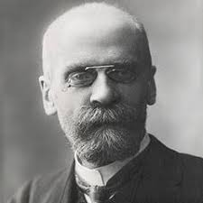

```{r setup, include=FALSE}
knitr::opts_chunk$set(echo = FALSE)
library(png)


library(tidyverse)
library(igraph)
library(visNetwork)

edges_1 <- data_frame(from = c('1', '1'),
                      to = c('2', '3'))
nodes_1 <- data_frame(id = 1:3, label = c('Elliot', 'Josh', 'Mike'))
triad <- visNetwork(nodes_1, edges_1, width = "100%") %>%
  visNodes(
    shape = "square",
    color = list(
      background = "lightblue",
      border = "darkblue",
      highlight = "yellow"
    ),
    shadow = list(enabled = TRUE, size = 10)
  )
visSave(triad,file = 'triad.html')

edges_2 <- data_frame(
  from = c('1', '1', '2'),
  to = c('2', '3', '3'),
  dashes = c(F, F, T)
)
nodes_2 <- data_frame(id = 1:3, label = c('Elliot', 'Josh', 'Mike'))
forbidden_triad <- visNetwork(nodes_2, edges_2, width = "100%") %>%
  visNodes(
    shape = "square",
    color = list(
      background = "lightblue",
      border = "darkblue",
      highlight = "yellow"
    ),
    shadow = list(enabled = TRUE, size = 10)
  )
visSave(forbidden_triad,file = 'forbidden_triad.html')
```
## Networks: History & Terminology 
In this section we will discuss 
 
 1. A, very brief, history of network analysis in academic literature
    + Grannovetter (1978)
         . . . *forbidden tryads*
 
 2. Key terminology needed in discussing network attributes. 
    + Measures of centrality
        - Degree
        - Betweeness
        - Closeness
        
## History
Social networks have been a prominent part of sociological theory since the very beginning.

     
   
## History
In 1978, Mark Granovetter published his seminal paper, *The Strength of Weak Ties*, which introduced a concise and coherent of how information flows in networks. 
```{r,echo=FALSE,message=FALSE,results='asis'}
htmltools::includeHTML('triad.html')
htmltools::includeHTML('forbidden_triad.html')

```


        
        
        
        
