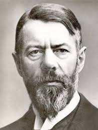

```{r setup, include=FALSE, echo=FALSE}
knitr::opts_chunk$set(echo = FALSE)
knitr::opts_chunk$set(echo = FALSE)
library(png)
library(tidyverse)
library(igraph)
library(visNetwork)

rescale <- function(nchar,low,high){
    min_d <- min(nchar)
    max_d <- max(nchar)
    rscl <- ((high-low)*(nchar-min_d))/(max_d-min_d) + low
    rscl
}
edges <- data_frame(
  from = c('1', '1', '11', '11', '12'),
  to = c('2', '3', '12', '13', '13'),
  dashes = c(F, F, F, F, T)
)

nodes <-
  data_frame(
    id = c(1:3, 11:13),
    label = c('Elliot', 'Josh', 'Mike', 'Elliot', 'Josh', 'Mike')
  )

triad <- visNetwork(nodes, edges, width = "100%") %>%
  visNodes(
    shape = "square",
    color = list(
      background = "lightblue",
      border = "darkblue",
      highlight = "yellow"
    ),
    shadow = list(enabled = TRUE, size = 10)
  )%>% 
  visInteraction(navigationButtons = TRUE)
visSave(triad, file = 'triad.html')

g <- sample_pa(50)
edges <- igraph::as_data_frame(g) %>% 
  set_names('from','to')
nodes <- edges %>% 
  gather(key,value) %>% 
  select(value) %>% 
  distinct() %>% 
  arrange(value) %>% 
  rename(id = value)
nodes$size <- degree(g) %>% rescale(.,15,50)
nodes$label <- nodes$id
size_degree <- visNetwork(nodes, edges, width = "100%") %>%
  visNodes(
    shape = "dot",
    color = list(
      background = "lightblue", # make SRUC colors??
      border = "darkblue",
      highlight = "yellow"
    ),
    shadow = list(enabled = TRUE, size = 10)
  ) %>% 
  visOptions(highlightNearest = TRUE,selectedBy = )%>% 
  visInteraction(navigationButtons = TRUE)
 # Network sized degree
visSave(size_degree, file = 'size_degree.html')


nodes$size <- closeness(g) %>% rescale(.,50,15)

size_closeness <- 
  visNetwork(nodes, edges, width = "100%") %>%
  visNodes(
    shape = "dot",
    color = list(
      background = "lightblue", # make SRUC colors??
      border = "darkblue",
      highlight = "yellow"
    ),
    shadow = list(enabled = TRUE, size = 10)
  ) %>% 
  visOptions(highlightNearest = TRUE)%>% 
  visInteraction(navigationButtons = TRUE)
 # Network sized by closeness
visSave(size_closeness, file = 'size_closeness.html')

nodes$size <- betweenness(g) %>% rescale(.,50,15)

size_betweenness <- 
  visNetwork(nodes, edges, width = "100%") %>%
  visNodes(
    shape = "dot",
    color = list(
      background = "lightblue", # make SRUC colors??
      border = "darkblue",
      highlight = "yellow"
    ),
    shadow = list(enabled = TRUE, size = 10)
  ) %>% 
  visOptions(highlightNearest = TRUE)%>% 
  visInteraction(navigationButtons = TRUE)
 # Network sized by betweenness
visSave(size_betweenness, file = 'size_betweenness.html')

nodes$size <- eigen_centrality(g)$vector %>% rescale(.,15,50)

size_eigen <- 
  visNetwork(nodes, edges, width = "100%") %>%
  visNodes(
    shape = "dot",
    color = list(
      background = "lightblue", # make SRUC colors??
      border = "darkblue",
      highlight = "yellow"
    ),
    shadow = list(enabled = TRUE, size = 10)
  ) %>% 
  visOptions(highlightNearest = TRUE)%>% 
  visInteraction(navigationButtons = TRUE)
 # Network sized by eigenvector
visSave(size_eigen, file = 'size_eigen.html')
```

## Networks: History & Terminology 
In this section we will discuss 
 
 1. A, very brief, history of network analysis in academic literature
    + Grannovetter (1978)
         . . . *forbidden tryads*
 
 2. Key terminology needed in discussing network attributes. 
    + Measures of centrality
        - Degree
        - Betweeness
        - Closeness
        
        
        
        

## History
Social networks have been a prominent part of sociological theory since the very beginning.

     
   
   
   
   
   
   
## History
In 1978, Mark Granovetter published his seminal paper, *The Strength of Weak Ties*, which introduced a concise and coherent theory of how information flows in networks.

  1. The **Forbidden tryad**
  
    [*definition*] If two people are connected to the same person, they are inherently connected.
      
```{r,echo=FALSE,message=FALSE,results='asis'}
htmltools::includeHTML('triad.html')
```


## Degree
```{r,echo=FALSE,message=FALSE,results='asis'}
htmltools::includeHTML('size_degree.html')
```


## Closeness
```{r,echo=FALSE,message=FALSE,results='asis'}
htmltools::includeHTML('size_closeness.html')
```


## Betweenness
```{r,echo=FALSE,message=FALSE,results='asis'}
htmltools::includeHTML('size_betweenness.html')
```


## Eigenvector
```{r,echo=FALSE,message=FALSE,results='asis'}
htmltools::includeHTML('size_eigen.html')
```


